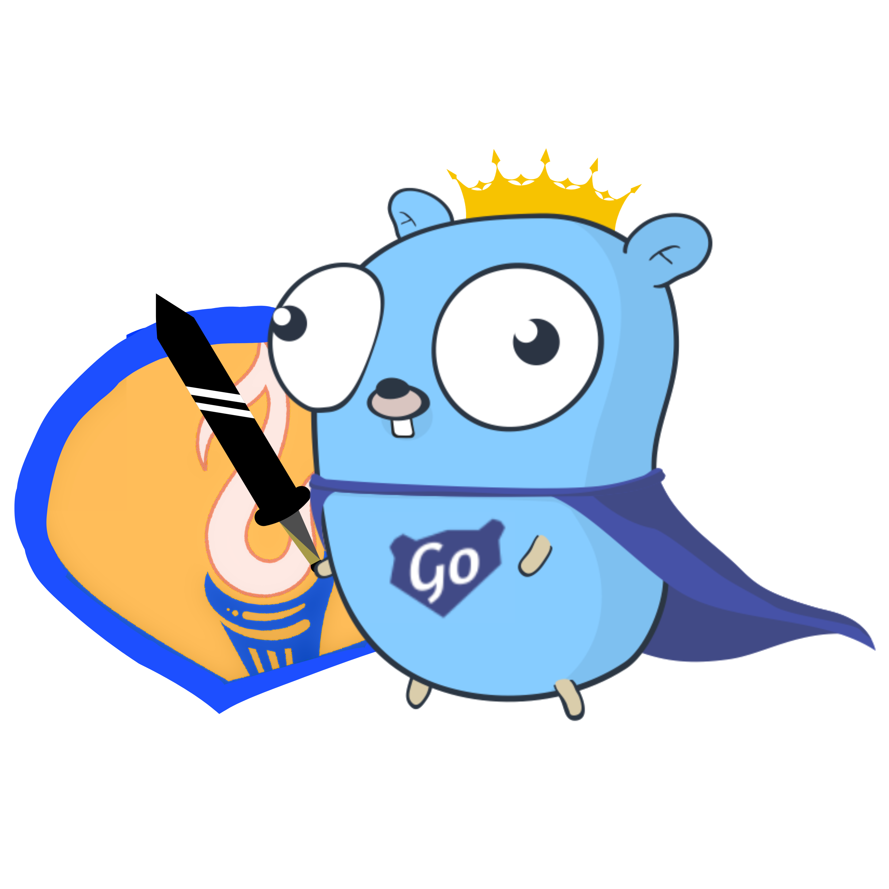

# go-amizone




[][coveralls]
[][go-report-card]
[][go-reference]
[][issues]


`go-amizone` is a minimalistic library that aims to provide a simple and robust API client for the
[Amizone](https://s.amizone.net) student portal. It is intended to be used as an API or as an SDK in your Go application.

> **Status:** Not actively maintained as of January 2024. Forks are welcome, but so are new maintainers
> for this canonical repository given they can commit to maintaining the quality and security
> standards of the project with proof of work.

## Inspiration

Amizone is _the_ student portal for [Amity University](https://www.amity.edu/). It's indispensable for students to
access their grades, attendance, class schedule and other information. The catch: it's buggy, slow and goes down all the
time! Students have made a slew of alternative apps and tools to access the portal over the years -- many of them mobile
apps, but also arguably better approaches like the excellent [monday-api][monday-api] bot by [@0xSaurabh][0xSaurabh]
(the inspiration for this project!).

**But why go-amizone then?** I went looking for a lean API / SDK for Amizone and couldn't find one that was good enough.
I set out to build something that I could use for my own projects around the portal, and that others could use
too. Something that would last and be easy to maintain, integrate into projects across languages and form factors.
Now while `go-amizone` is written in Go, it has both a gRPC and REST API server which enables autogenerated SDKs for
any language under the sun! For more information, check out the [API Server](#api-server) section below.

## Completeness

`go-amizone` is far from complete, but it is stable and in use today. In fact, it's already being used in production by
over a 1000 students, through [Amibot](https://github.com/asetalias/amibot), [Amibot TG](https://github.com/asetalias/amibot-tg)
and other community projects. There is some indication of adoption by some mobile apps as well, developers are
encouraged to reach out and let me know!

## Installation

The library can be installed either as an SDK to use in your own Go project or as a self-hosted API with the server
binary. With the latter, you would be able to use Swagger to generate SDKs for other languages in the near future.

### SDK

Install the library using `go get github.com/ditsuke/amizone-go`. The public API is well documented through godocs,
easily accessed on [pkg.go.dev][go-reference] or [godocs.io][godocs.io].

### API Server

The API Server offers a RESTful API through a single Go binary. It is intended to be used self-hosted on a VPS or a PaaS
like [Fly][fly], but I have a public instance running at https://amizone.fly.io. You can always host your own,
spinning up a new instance is as easy as running the following commands:

```shell
go install github.com/ditsuke/go-amizone/cmd/amizone-api-server@latest # installs the binary
amizone-api-server # runs the server
```

#### Postman collection

Check out this [Postman collection](https://www.postman.com/ditsuke/workspace/ditsuke) to test out our endpoints, both gRPC and REST.

## Contributing

Contributions to go-amizone are welcome! If you have a bug or feature request, please open an issue on the
[GitHub repo][github]. Code contributions should be a great way to get started with Go development and learn
about the language, reverse-engineering, and other cool stuff.

Please read the [contribution guide](./CONTRIBUTING.md) for more information on how to get started.

[monday-api]: https://github.com/0xSaurabh/monday-api
[0xSaurabh]: https://github.com/0xSaurabh/
[github]: https://github.com/ditsuke/amizone-go
[issues]: https://github.com/ditsuke/amizone-go/issues
[go-reference]: https://pkg.go.dev/github.com/ditsuke/go-amizone
[coveralls]: https://coveralls.io/github/ditsuke/go-amizone?branch=main
[fly]: https://fly.io
[go-report-card]: https://goreportcard.com/report/github.com/ditsuke/go-amizone
[godocs.io]: https://godocs.io/github.com/ditsuke/go-amizone
